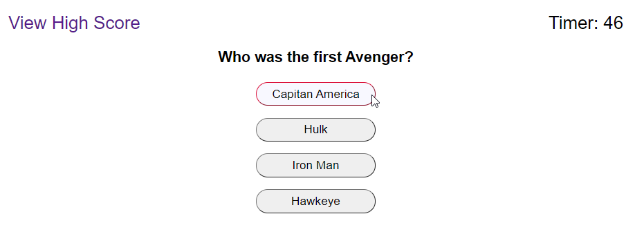
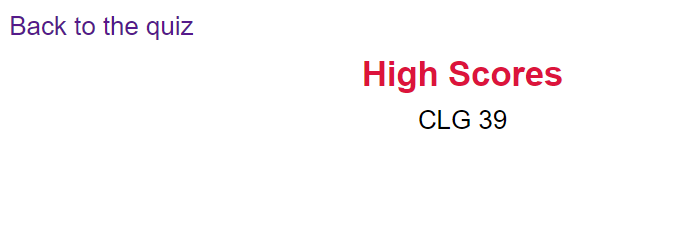

# 04-Web-APIs-Code-Quiz

Web Api Marvel Quiz

The goal of this site is to create a mini quiz that will save the users initials and score. 

The user will be shown a start button and instructions for the quiz. When the user answers correctly they will be alerted, if they answer incorrectly they will lose time. At the end the time remaining is the users score of which they can store their initials and score to the high score board.   

Below is a screen shot of the Quiz:

Below is a link to the site:

https://codyg-2021.github.io/04-Web-APIs-Code-Quiz/
